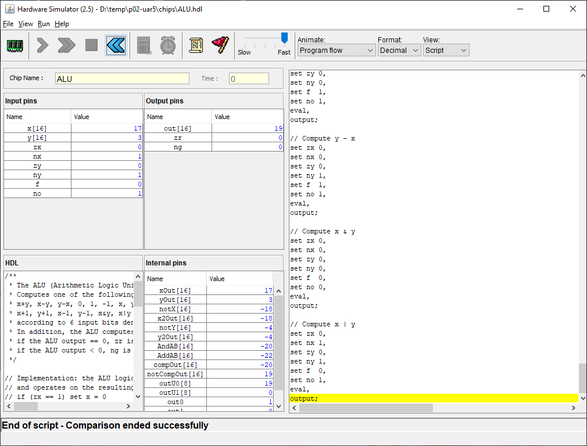

# CS 243 Assignment #4

## Important
Unlike prior assignments, your task is not from the back of the chapter.  Instead, complete the following tasks

1. Write a **Factorial** program (use R0 as the starting value, store results in R1).
2. Modification of the **Fill** function in the book.  Instead of having the screen go all black, have 8 vertical black bars on the screen.

# Getting Started
Begin by creating a private repository in the course's [GitHub organization](https://github.com/HSU-S21-CS243).
Your repository name **__must__** be in the following format: ```p04-{HSU LOGIN}```.  Thus, my project repository
name would be ```p04-asc564```.  

Once created, your repository should have:
* an "asm" directory that contains your assembly solutions
* a "results" directory that contains screenshots and animated GIFs from the testing results obtained through the CPU simulator
   * For the "fill" program, please uploaded an animated GIF
   * For the "factorial" program, please upload a screenshot of the test results (see repository for the test cases)

Below is an example GIF for the original fill program (your should not look like this!):


Below is an example static screenshot with test results:


**__NOTICE:__** Failing to set up your repository correctly will result in reduced assignment credit.  

# Design Diary Prompt
Design diaries should be a paragraph or two.  You will be graded on content (i.e. it shows 
deep thought) rather than syntax (e.g. spelling) and structure.  Below are some prompts that can be used to get 
you thinking.  Feel free to use these or to make up your own.
* Describe a particular struggle that you overcame when working on this programming assignment.
* Conversely, describe an issue with your assignment that you were unable to resolve.
* Provide advice to a future student on how he or she might succeed on this assignment.
* Describe the most fun aspect of the assignment.
* Describe the most challenging aspect of the assignment.
* Describe the most difficult aspect of the assignment to understand.
* Provide any suggestions for improving the assignment in the future.

Your design diary will be submitted on canvas and **__should not__** be included in your repository.

# Grading
You will be graded using the following:
* [50 pts] Completing the factorial program.
* [50 pts] Completing the modified screen program.
* [10 pts] Writing a good design diary

# Due Date
This project is due by Midnight on February 19, 2021.  Your repository should contain all code and output files from the test runs provided to you by the book.  On canvas, you will submit your buddy report and design diary.